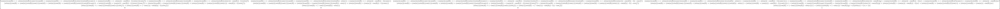

# Zeus i611 Robot Arm and Manipulator

## Introduction
Since this robot system is based on the internal library from the manufacturer, the structure of the code is quite tricky to comprehend even with the distributed manual from [here](http://zero.globalzeus.com/scara/).    
Thus I would like to make more user-friendly interface of using it, in order to let the user to feel more comfortable when encountered the robot interface for the first time.    
This interface might not give you as sophisticated control as the original library, but *WAY* simpler, thus easier to adapt and proceed to real interface.   

## How to use (T.B.A.)
1. RUN main.py

## Structure (Temporary)
### mechanical_analysis
Here I tried to set mechanical model and solve the equation with Denavit-Hartenberg Kinematic Parameters and Homogenous Transformation Matrix with euler angles. (Basically Robot Forward Kinematics)   
In addition, this directory includes matrix calculator with characters, which can be utilized in versatile purposes.    

### non_python_materials
Here I tried to visualize the results made from mechanical_analysis directory. However since the matrix was too complex, I chosed to leave the files like this instead.   
Please click the image below or check this matrix. 
   
```python
homogeneous_transformation_matrix = [((-sin(a)*cos(b) - sin(b)*cos(a))*sin(e) + (-(-sin(a)*sin(b) + cos(a)*cos(b))*sin(c)*sin(d) + (-sin(a)*sin(b) + cos(a)*cos(b))*cos(c)*cos(d))*cos(e))*cos(f) + (-(-sin(a)*sin(b) + cos(a)*cos(b))*sin(c)*cos(d) - (-sin(a)*sin(b) + cos(a)*cos(b))*sin(d)*cos(c))*sin(f)
  ,(-sin(a)*cos(b) - sin(b)*cos(a))*cos(e) - (-(-sin(a)*sin(b) + cos(a)*cos(b))*sin(c)*sin(d) + (-sin(a)*sin(b) + cos(a)*cos(b))*cos(c)*cos(d))*sin(e)
  ,((-sin(a)*cos(b) - sin(b)*cos(a))*sin(e) + (-(-sin(a)*sin(b) + cos(a)*cos(b))*sin(c)*sin(d) + (-sin(a)*sin(b) + cos(a)*cos(b))*cos(c)*cos(d))*cos(e))*sin(f) - (-(-sin(a)*sin(b) + cos(a)*cos(b))*sin(c)*cos(d) - (-sin(a)*sin(b) + cos(a)*cos(b))*sin(d)*cos(c))*cos(f)
  ,-l*sin(a)*sin(b) + l*cos(a)*cos(b) + w*(-sin(a)*cos(b) - sin(b)*cos(a)) + x*(-sin(a)*cos(b) - sin(b)*cos(a)) + y*((-sin(a)*sin(b) + cos(a)*cos(b))*sin(c)*cos(d) + (-sin(a)*sin(b) + cos(a)*cos(b))*sin(d)*cos(c)) + z*((-sin(a)*cos(b) - sin(b)*cos(a))*cos(e) - (-(-sin(a)*sin(b) + cos(a)*cos(b))*sin(c)*sin(d) + (-sin(a)*sin(b) + cos(a)*cos(b))*cos(c)*cos(d))*sin(e))]
 ,[((-sin(a)*sin(b) + cos(a)*cos(b))*sin(e) + (-(sin(a)*cos(b) + sin(b)*cos(a))*sin(c)*sin(d) + (sin(a)*cos(b) + sin(b)*cos(a))*cos(c)*cos(d))*cos(e))*cos(f) + (-(sin(a)*cos(b) + sin(b)*cos(a))*sin(c)*cos(d) - (sin(a)*cos(b) + sin(b)*cos(a))*sin(d)*cos(c))*sin(f)
  ,(-sin(a)*sin(b) + cos(a)*cos(b))*cos(e) - (-(sin(a)*cos(b) + sin(b)*cos(a))*sin(c)*sin(d) + (sin(a)*cos(b) + sin(b)*cos(a))*cos(c)*cos(d))*sin(e)
  ,((-sin(a)*sin(b) + cos(a)*cos(b))*sin(e) + (-(sin(a)*cos(b) + sin(b)*cos(a))*sin(c)*sin(d) + (sin(a)*cos(b) + sin(b)*cos(a))*cos(c)*cos(d))*cos(e))*sin(f) - (-(sin(a)*cos(b) + sin(b)*cos(a))*sin(c)*cos(d) - (sin(a)*cos(b) + sin(b)*cos(a))*sin(d)*cos(c))*cos(f)
  ,l*sin(a)*cos(b) + l*sin(b)*cos(a) + w*(-sin(a)*sin(b) + cos(a)*cos(b)) + x*(-sin(a)*sin(b) + cos(a)*cos(b)) + y*((sin(a)*cos(b) + sin(b)*cos(a))*sin(c)*cos(d) + (sin(a)*cos(b) + sin(b)*cos(a))*sin(d)*cos(c)) + z*((-sin(a)*sin(b) + cos(a)*cos(b))*cos(e) - (-(sin(a)*cos(b) + sin(b)*cos(a))*sin(c)*sin(d) + (sin(a)*cos(b) + sin(b)*cos(a))*cos(c)*cos(d))*sin(e))]
 ,[(sin(c)*sin(d) - cos(c)*cos(d))*sin(f) + (-sin(c)*cos(d) - sin(d)*cos(c))*cos(e)*cos(f)
  ,-(-sin(c)*cos(d) - sin(d)*cos(c))*sin(e)
  ,-(sin(c)*sin(d) - cos(c)*cos(d))*cos(f) + (-sin(c)*cos(d) - sin(d)*cos(c))*sin(f)*cos(e)
  ,u + v + y*(-sin(c)*sin(d) + cos(c)*cos(d)) - z*(-sin(c)*cos(d) - sin(d)*cos(c))*sin(e)]
 ,[0, 0, 0, 1]]
```
for more information like this, please check [here](https://github.com/skykongkong8/i611_RobotManipulator/tree/master/mechanical_analysis)

### teleoperation
*This is just for test for now. Some codes might not work.*
#### robotarm_teleoperation_keyboard_RPY
* By Telnet connection (Tera Term recommended), after sending all the files via FFFTP, run:
```python
python main.py -keyboard_RPY
```
* keyboard operation
```command
_____________________________
| Moving around x-y plane:  |
|     w                     |
| a   s   d                 |
|     x                     |
|                           |
| Moving around z-axis:     |
|                           |
| h (high)   l (low)        |
|                           |
| u (undo)                  |
|___________________________|
```
#### robotarm_teleoperation_keyboard_JNT
* By Telnet connection (Tera Term recommended), after sending all the files via FFFTP, run:
```python
python main.py -keyboard_JNT
```
* keyboard operation
```command
_________________________________
|    Joint Control:             |
|        w                      |
|    a   s   d                  |
|        d                      |
|                               |
|   Chmod:                      |
|    u   : Joint 1 & Joint 2    |
|    j   : Joint 3 & Joint 4    |
|    m   : Joint 5 & Joint 6    |
|_______________________________|
```
#### robotarm_teleoperation_command
* By Telnet connection (Tera Term recommended), after sending all the files via FFFTP, run:
```python
python main.py -command (your_command)
```
* Command Examples:
```command
[axis control]
    +x -x
    +y -y
    +z -z

[additional control]
    -home
    -undo
```